# Java Fundamentals Journey

<div align="center">

[](https://www.oracle.com/java/)
[](https://github.com)
[](https://github.com)
[](https://github.com)

</div>

## 🎯 Visión General

Repositorio dedicado al aprendizaje sistemático de los fundamentos de Java. Cada módulo representa un hito en la construcción de una base sólida en programación orientada a objetos y las mejores prácticas del lenguaje.

## 📋 Estructura del Curriculum

<details>
<summary><strong>📊 Seguimiento de Progreso</strong></summary>

```
██████████████████████████░░░░░░░░░░░░░░░░░░░░░░░░░░░░░░░░░░░░ 25% Completado
```

| Módulo | Tema | Estado | Notas Técnicas |
|--------|------|---------|----------------|
| `#00` | **Introducción a Java** | ✅ | Fundamentos establecidos |
| `#01` | **Sintaxis, Variables y Tipos de Datos** | ✅ | Conceptos básicos dominados |
| `#02` | **Operadores y Estructuras de Control** | ✅ | Flujo lógico implementado |
| `#03` | **Funciones y Alcance** | 🔄 | *En desarrollo activo* |
| `#04` | **Estructuras de Datos** | ⏳ | Arrays y colecciones |
| `#05` | **Manipulación de Cadenas** | ⏳ | Procesamiento de texto |
| `#06` | **Valor y Referencia** | ⏳ | Gestión de memoria |
| `#07` | **Recursividad** | ⏳ | Algoritmos recursivos |
| `#08` | **Pilas y Colas** | ⏳ | Estructuras lineales |
| `#09` | **Clases y Objetos** | ⏳ | Fundamentos POO |
| `#10` | **Herencia y Polimorfismo** | ⏳ | POO avanzada |
| `#11` | **Manejo de Excepciones** | ⏳ | Control de errores |

</details>

## 🏗️ Enfoque Actual

### Módulo #03: Funciones y Alcance
> *Dominando la creación de métodos, paso de parámetros y gestión del scope*

**Conceptos en Desarrollo:**
- Declaración e invocación de métodos
- Distinción entre parámetros y argumentos
- Implicaciones del scope local vs global
- Optimización de tipos de retorno
- Principios de sobrecarga de métodos

## 💾 Arquitectura del Repositorio

```
java-fundamentals/
│
├── ejercicios/
│   ├── modulo-00-introduccion/
│   ├── modulo-01-sintaxis-variables/
│   ├── modulo-02-operadores-control/
│   ├── modulo-03-funciones-alcance/     ← Desarrollo actual
│   └── ...
│
├── recursos/
│   ├── notas/
│   ├── referencias/
│   └── mejores-practicas/
│
└── README.md
```

## 🔧 Entorno de Desarrollo

**Runtime:** OpenJDK 17+  
**IDE:** IntelliJ IDEA / VS Code  
**Compilación:** Manual (`javac` → `java`)  
**Control de Versiones:** Git con commits convencionales

## 📈 Métricas de Aprendizaje

<div align="center">

| Métrica | Valor |
|---------|--------|
| **Módulos Completados** | 3/12 |
| **Conceptos Dominados** | Variables, Tipos, Control de Flujo |
| **Enfoque Actual** | Implementación de Métodos |
| **Próximo Hito** | Estructuras de Datos |
| **Nivel de Competencia** | Intermedio Básico |

</div>

## 🎨 Estándares de Calidad

- **Convención de Nomenclatura:** camelCase para variables/métodos, PascalCase para clases
- **Documentación:** Comentarios exhaustivos para lógica compleja
- **Testing:** Validación manual con casos de entrada diversos
- **Estructura:** Código limpio siguiendo convenciones Java

## 🚀 Roadmap de Desarrollo

```mermaid
graph LR
    A[Sintaxis Básica] --> B[Control de Flujo]
    B --> C[Funciones] 
    C --> D[Estructuras de Datos]
    D --> E[POO Básica]
    E --> F[POO Avanzada]
    F --> G[Manejo de Errores]
    
    style A fill:#4CAF50
    style B fill:#4CAF50
    style C fill:#FF9800
    style D fill:#E0E0E0
    style E fill:#E0E0E0
    style F fill:#E0E0E0
    style G fill:#E0E0E0
```



## 🎯 Objetivos de Aprendizaje

### Corto Plazo (1-2 semanas)
- [x] Dominar sintaxis fundamental
- [x] Implementar estructuras de control
- [ ] **Perfeccionar métodos y scope**
- [ ] Trabajar con arrays y colecciones

### Mediano Plazo (1 mes)
- [ ] Comprender gestión de memoria
- [ ] Implementar algoritmos recursivos
- [ ] Dominar conceptos POO básicos

### Largo Plazo (2-3 meses)
- [ ] Aplicar patrones de diseño
- [ ] Manejar excepciones eficientemente
- [ ] Desarrollar aplicaciones completas

## 📚 Stack Tecnológico

**Core:**
- Java SE 17+
- OpenJDK Runtime

**Herramientas:**
- Git para versionado
- IDE: INTELLIJ
- Terminal para compilación manual

**Metodología:**
- Aprendizaje iterativo
- Práctica deliberada
- Revisión continua de código

## 🔄 Proceso de Desarrollo

**Flujo Diario:** Sesiones enfocadas de 45-60 minutos  
**Revisión Semanal:** Retrospectiva de módulos completados  
**Validación:** Implementación práctica de conceptos aprendidos

---

<div align="center">

### 🎯 "Construyendo bases sólidas para soluciones escalables"

**Estado Actual:** Desarrollando fundamentos que perduran

*Última Actualización:* Módulo de Funciones en desarrollo activo

</div>

---

<details>
<summary><strong>📋 Comandos Rápidos</strong></summary>

```bash
# Compilar y ejecutar módulo actual
javac NombreModulo.java && java NombreModulo

# Navegar al ejercicio actual
cd ejercicios/modulo-03-funciones-alcance/

# Ver progreso
git log --oneline --graph

# Limpiar archivos compilados
find . -name "*.class" -delete
```

</details>

## 🤝 Contribución y Colaboración

- 🐛 **Issues:** Reportar errores o sugerir mejoras
- 💡 **Discussions:** Intercambiar ideas sobre implementaciones
- ⭐ **Stars:** Si este repositorio aporta valor a tu aprendizaje
- 🍴 **Fork:** Crear tu propia versión personalizada

---

<div align="center">

**Desarrollado con dedicación y enfoque en la excelencia técnica**

</div>
